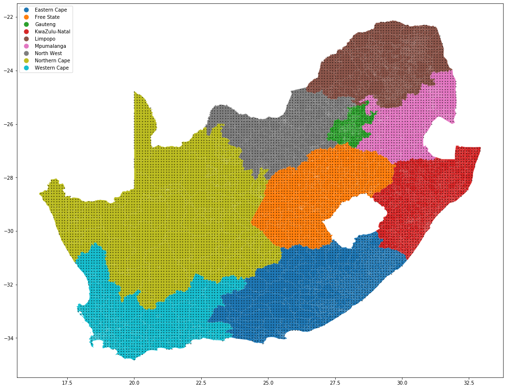

# Geospatial Lookup Data - South Africa
Data and methodology to be used within a relational database with which to perform geospatial lookup and enrich location data for South Africa 

## Motivation
Interacting with geospatial or location information within a relational database is difficult - one usually has only a few options:
- perform a complex join involving sub-queries and "best guess approximations" based on proximity
- export the data to another tool in order to extract enrichment information
- perform an api call to obtain enrichment information - something that usually ends up costing money
- be lucky enough to have database extensions that allow for geospatial computations

This repository provides a neat alternative.



## Methodology
1. Generate a grid over the country of interest (South Africa in this repository but feel free to fork!)
2. Grid can be as coarse or fine as is necessary (in the example image, dots are spaced 1km apart)
3. Translate the approximate accuracy into the required number of decimal points for the latitude and longitude values
Here is a very scientific guide to decide what is appropriate:

4. Look up all the generated grid points against the source of your choice (see motivation) 
5. Store the results in your relational database, adding a composite text-based lookup key based on the desired accuracy level (point 3).  This is to ease database joins.  The alternative is to join to both latitude and longitude after truncation.
6. Transform the (latitude, longitude) pairs you wish to look up according to the accuracy level
7. Perform a simple database join to obtain the information you gathered in the steps above

## Coordinate transformation
The coordinate transformation required is as follows (you may need to adapt it slightly to your flavour of SQL):

```sql
SELECT 
    cast(cast(latitude*100000/accuracy_m as int) as varchar)
  + '|'
  + cast(cast(longitude*100000/accuracy_m as int) as varchar) as lookup_key
FROM input_data
```
> where accuracy_m is the accuracy in meters, i.e. ` accuracy_m in (1, 10, 100, 1000, 10000) `
